# CRUD con api REST usando json-server

### ¿Qué hay en este documento?

Este documento fue creado con fines educativos para explicar cómo hacer una api en un nivel básico y realizar un CRUD a través de las peticiones HTTP que modificarán nuestra base de datos hecha en JSON.

# Tabla de contenidos

1. [Introducción](#introducción)
   1. [Petición XHR](#petición-xhr)
   2. [Petición Axios](#petición-axios)
2. [Instalaciones necesarias](#instalaciones-necesarias)
3. [Primeros pasos en Axios](#primeros-pasos-en-axios)

# Instalaciones necesarias

1. [Node.js](https://nodejs.org/en/download)
2. [JSON Viewer Pro](https://chrome.google.com/webstore/detail/json-viewer-pro/eifflpmocdbdmepbjaopkkhbfmdgijcc)

# Primeros pasos - json-server

Como ya tenemos instalado Node.js, crearemos una carpeta llamada **json-server** y será nuestro punto de partida.

Ahora, nos posicionamos en la terminal y la carpeta **json-server**, y ponemos los siguientes comandos.

```
  npm init -y
  npm install axios
```

Cuando usamos **npm init -y** se creará el archivo **package.json**, debemos dirigirnos a este archivo y veremos algo como esto:

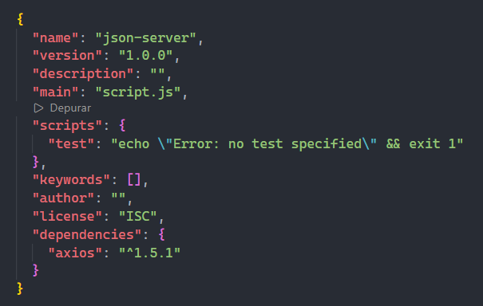

Debajo de la línea `"main": "script.js",` ponemos este código:
```json
  "type" : "module",
```

Debería quedar algo así:

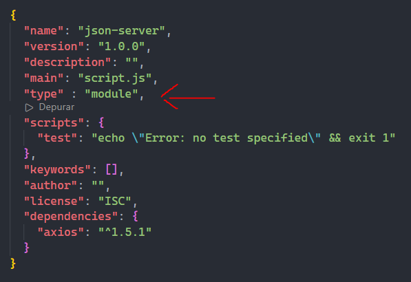

Luego de modificar **package.json**, dentro de la misma carpeta **json-server** creamos el archivo **db.json** y ponemos este código:

``` json
{
  "productos": [
    { "id": 1, "nombre": "Jabón Rey", "precio": 3000 },
    { "id": 2, "nombre": "Chocorramo", "precio": 2000},
    { "id": 3, "nombre": "Clorox", "precio": 1600 }
  ]
}
```

Ahora, desde nuestra terminal, ponemos el comando
```
json-server -w -p 5555 db.json
```

En esta parte, "**-w**" indica que nuestra terminal se convierte en un servidor local, y observa todos los cambios de nuestro db.json. Este servidor local se comporta como una API REST simulada y escucha las solicitudes HTTP que luego realizaremos. Luego, "**-p 5555**" nos indica el puerto desde el cual recibiremos las peticiones. Finalmente, la parte **db.json** es el archivo destino que la terminal observará con **-w**.

Si ejecutamos bien el comando, saldrá algo como esto:

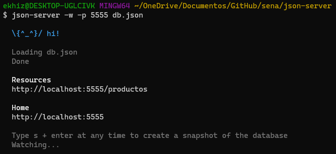

Como podemos ver, nos devuelve un puerto. Ahora nos dirigimos al puerto http://localhost:5555/ y encontraremos esto

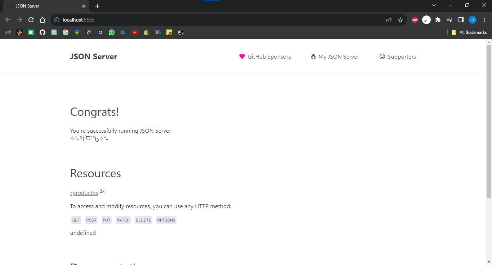

En esta misma página, en la parte de Resources encontramos un link el cual dice **/productos**, pulsamos en él.

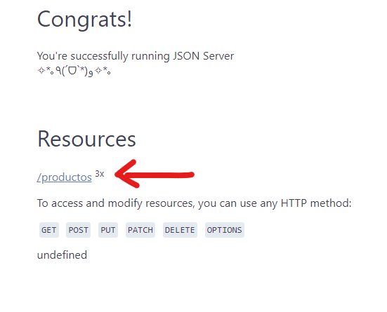

Nos va a redirigir a una página como esta

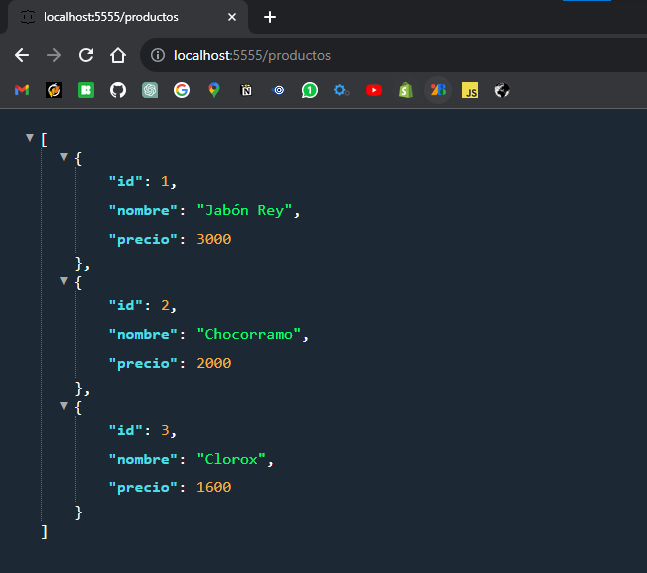

Como podemos observar, en la parte superior se encuentra el link http://localhost:5555/productos

Partiendo de este punto, podemos decir que accedimos al recurso **productos** de nuestra base de datos.

### Primer ejercicio

Ahora, en nuestro archivo **db.json** añadimos un nuevo producto teniendo en cuenta de que este debe tener el id 4.

Una vez creado el nuevo producto, guardamos el archivo **db.json** e inmediatamente revisamos la terminal en donde está nuestro servidor, veremos algo como esto:

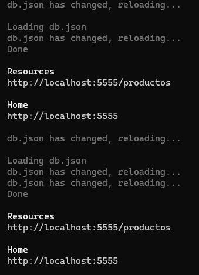

Esto nos indica que el servidor estuvo pendiente de los cambios y se reinició.

Revisamos el JSON en el navegador que vimos anteriormente y recargamos la página, o simplemente probamos esta URL en el navegador http://localhost:5555/productos.

Veremos que se ha añadido nuestro cuarto producto, un ejemplo sería este:

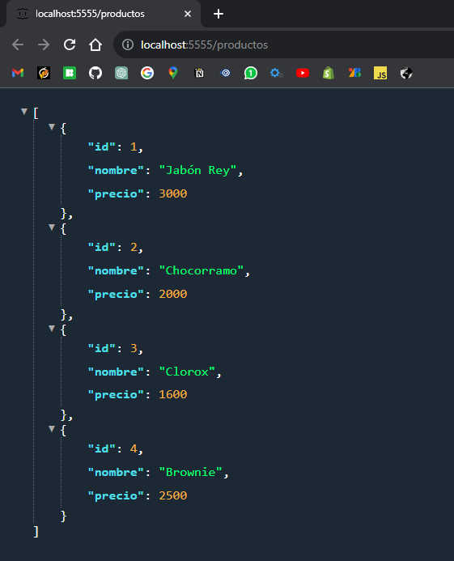

En esa misma página, vamos a la url y la modificamos para que quede así:

```
http://localhost:5555/productos/1
```

Pulsamos la tecla **Enter** para acceder, y veremos que nos trae únicamente el producto con el ID 1.

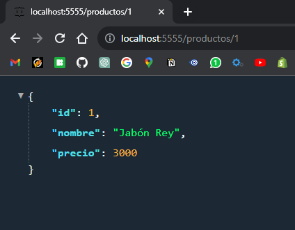

Podemos probar con los demas productos cambiando el número y veremos que nos retorna únicamente ese elemento.

# Método GET

Ahora, dentro de la carpeta **json-server** crearemos un archivo llamado **app.js**, y pondremos este código:

``` javascript
import axios from 'axios'

const apiUrl = 'http://localhost:5555';

const obtenerProductos = async () => {
  try {
    const respuesta = await axios.get(`${apiUrl}/productos/`);
    console.log('Lista de productos:', respuesta.data)
  } catch (error) {
    console.error('Error al obtener la lista de productos:', error);
  }
}

obtenerProductos();
```

Después abrimos otra terminal aparte de la que estamos ejecutando, nos aseguramos de estar dentro de la carpeta **json-server**, y ejecutamos el archivo **app.js** con el siguiente comando:

```
node app.js
```

Veremos que en nuestra consola aparece lo siguiente:

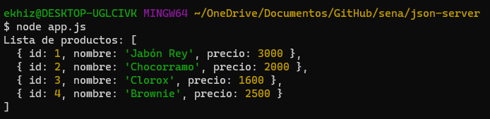

Y esta es nuestra primera solicitud GET a través de nuestra API REST simulada y más adelante probaremos otros métodos HTTP (POST, PUT, DELETE, PATCH).

Ahora modificaremos nuestra petición get, vamos al archivo **app.js**, ubicamos esta línea:

```javascript
const respuesta = await axios.get(`${apiUrl}/productos/`);
```

Y después de `productos/` ponemos el número 1, o cualquier otro ID entre el rango **1-4**, en nuestra consola veremos algo como esto:

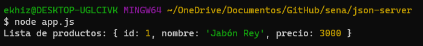

Como hicimos en el navegador, tambien podemos pedir los demás productos, para eso eliminamos el número 1 que acabamos de añadir en nuestra ruta, quedando como `${apiUrl}/productos/`.

Una vez hecho esto, volvemos a ejecutar **app.js** con node desde la terminal, y nos saldrá algo así:

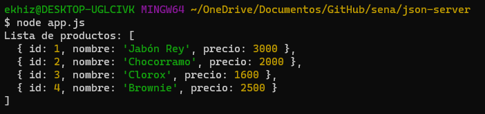

# Método POST

Ahora enviaremos un nuevo producto mediante POST, la estructura no es muy diferente del GET. Esta la estructura que usaremos:

``` javascript
const nuevoProducto = {
  "id": 5,
  "nombre": "Agua cristal",
  "precio": 1200
}

const crearProducto = async (producto) => {
  try {
    const respuesta = await axios.post(url, producto, header);
    console.log('Producto creado:', respuesta.data);
  } catch (error) {
    console.error('Error al crear el producto:', error);
  }
}

crearProducto(nuevoProducto);
```

En este código, vemos que hay un parámetro producto en `crearProducto()`, este lo crearemos por fuera para enviarselo a la función. Luego, vemos que en la petición tenemos tres parámetros: **url**, **producto** y **header**. Conocemos la url y hablaremos de los otros. Producto hace referencia al elemento que enviaremos desde afuera como argumento a la función. Y finamente, header hace referencia a metadatos (datos sobre los datos) que nos permiten establecer una "configuración" de la petición.

Por otro lado, hay otra manera de hacer una petición y es de la siguiente manera:

``` javascript
axios({
  method: 'post',
  url: `${apiUrl}/productos`,
  data: producto,
  headers: {
    'Content-Type': 'application/json'
  }
});
```

Como podemos observar, tenemos un objeto que se divide en cuatro partes donde tenemos el **método**, la **url**, la **data** (donde enviaremos el producto), y el **header**.

El código implementado de esa manera se vería así:

``` javascript
const nuevoProducto = {
  "id": 5,
  "nombre": "Agua Cristal",
  "precio": 1200
}

const crearProducto = async (producto) => {
  try {
    const respuesta = await axios({
      method: 'post',
      url: `${apiUrl}/productos`,
      data: producto,
      headers: {
        'Content-Type': 'application/json'
      }
    });
    console.log('Producto creado:', respuesta.data);
  } catch (error) {
    console.error('Error al crear el producto:', error);
  }
}

crearProducto(nuevoProducto);
```

De igual manera, podemos seguir trabajando con la estructura anterior:

``` javascript
const nuevoProducto = {
  "id": 5,
  "nombre": "Agua Cristal",
  "precio": 1200
}

const crearProducto = async (producto) => {
  try {
    const respuesta = await axios.post(`${apiUrl}/productos`, producto, {
      headers: {
        'Content-Type': 'application/json'
      }
    });
    console.log('Producto creado:', respuesta.data);
  } catch (error) {
    console.error('Error al crear el producto:', error);
  }
}

crearProducto(nuevoProducto);
```

Ahora lo implementaremos, vamos a hacer un POST, la tarea es utilizar el segundo código y lo pondremos en **app.js**, debajo del código que hicimos antes.

Una vez puesto, ejecutamos desde la terminal el archivo.

Veremos que nos aparece algo como esto:

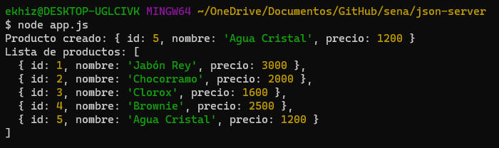

Como podemos ver, el servidor nos responde con el mensaje de que se creó el producto, y también nos devuelve la petición GET también ejecutamos.

Antes del segundo ejercicio, vamos a comentar la línea que ejecuta nuestro POST en **app.js**, debería quedar algo así:

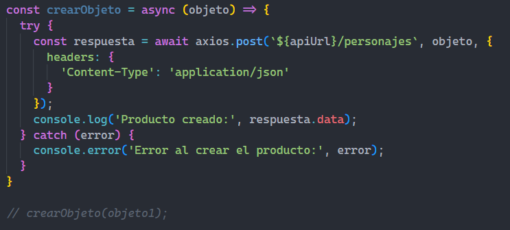

### Segundo ejercicio

Ahora vamos a crear un nuevo recurso en nuestra base de datos, nos ubicamos en nuestro **db.json** y este nuevo recurso es de tema libre, es decir se pueden crear personas, peliculas, libros, personajes de una serie, etc. Crear 2 o 3 elementos en el nuevo recurso.

Luego de haberlo creado, vamos a nuestro archivo **app.js** y la tarea es modificar la petición GET, vamos a acceder al nuevo recurso que se ha creado, el nombre es el mismo, por ejemplo si se creó como personajes,o personas la ruta será tal cual.  También modificar el `console.log` para que el mensaje coincida con el recurso.

Ahora ejecutamos el archivo para que traiga el nuevo recurso con GET, en mi caso sale así:

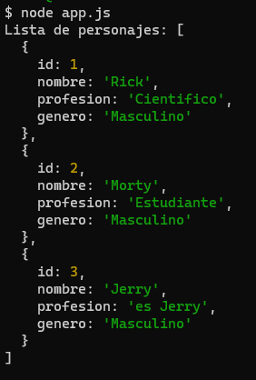

### Tercer ejercicio

Habiendo hecho eso, crearemos un nuevo elemento, para ello vamos a modificar nuestro POST cambiando el endpoint (ruta) haciendo referencia a nuestro nuevo recurso.

La tarea es analizar el código GET, y tomarlo como referencia para modificar el POST. También tenemos que modificar el objeto que enviamos.

Ejecutamos el archivo para enviar el nuevo elemento:

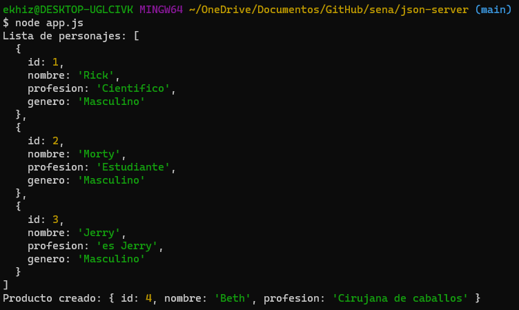

# Método PUT

Ahora usaremos el método PUT para modificar un elemento en nuestra BD.

Tenemos que volver a comentar la ejecución de nuestro POST, porque se estaría creando el mismo objeto de antes y generaría un error en nuestra consola.

Ponemos este código en nuestro **app.js**:

``` javascript
const objeto2 = {
    "id": 3,
    "nombre": "Jerry",
    "profesion": "Desempleado",
    "genero": "Masculino"
}

const actualizarObjeto = async (objeto) => {
  try {
    const respuesta = await axios.put(`${apiUrl}/recurso/${objeto.id}`, objeto, {
      headers: {
        'Content-Type': 'application/json'
      }
    });
    console.log('Producto actualizado:', respuesta.data);
  } catch (error) {
    console.error('Error al actualizar el producto:', error);
  }
}

actualizarObjeto(objeto2);
```

### Cuarto ejercicio

En este ejemplo, tengo un `objeto2`, hay que modificarlo para que coincida con un elemento existente dentro de la base de datos, o sea debe coinicidir con un **id** existente. También modificar el endpoint para acceder al recurso correcto.

Ejecutamos el código:

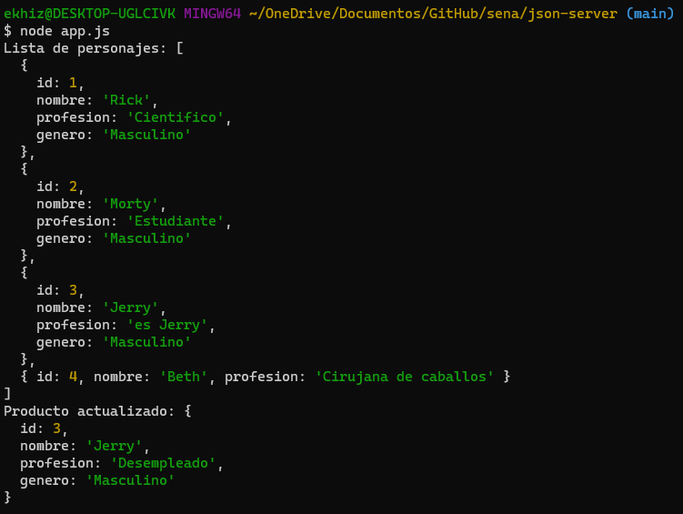

Como observamos, primero se ejecuta el GET y luego el PUT, ahora revisaremos nuestro **db.json**:

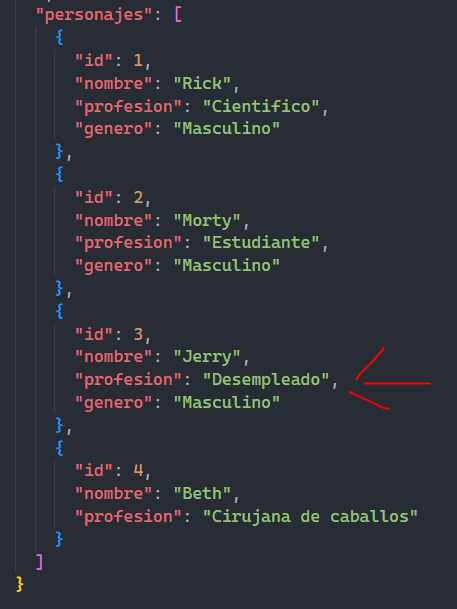

### Quinto ejercicio

Modificar otro registro con un **id** ya existente.

Una vez ejecutamos y modificamos el registro de la BD, comentamos la línea que ejecuta el método PUT para que no se vuelva a ejecutar.

# Método DELETE

Debajo del método PUT ponemos este código:

``` javascript
const eliminarRecurso = async (id) => {
  try {
    const respuesta = await axios.delete(`${apiUrl}/recurso/${id}`);
    console.log('Recurso eliminado con éxito:', respuesta.data);
  } catch (error) {
    console.error('Error al eliminar el recurso:', error);
  }
}

eliminarRecurso(4);
```

Verificamos el endpoint, y en la llamada de la función ponemos el objeto que queremos eliminar, recomiendo poner el id del ultimo elemento.

Lo ejecutamos:

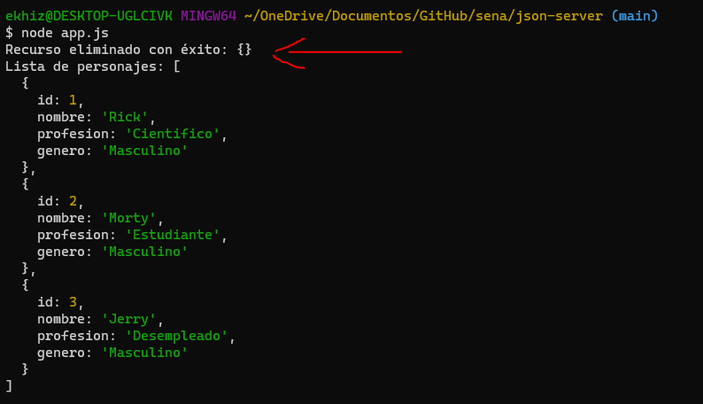
